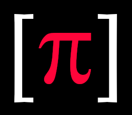

<!-- PROJECT LOGO -->
<br />
<p align="center">
  <a href="https://github.com/piyook/website-maintain-mode">
    
  </a>

  <h3 align="center">PHP Password Handler Utility Class</h3>

  <p align="center">
    Utility Class To Handle Password Generation and Password Strength Assessment
    <br />
  </p>
</p>


<!-- TABLE OF CONTENTS -->
<details open="open">
  <summary><h2 style="display: inline-block">Table of Contents</h2></summary>
  <ol>
    <li>
      <a href="#about-the-project">About The Project</a>
      <ul>
        <li><a href="#built-with">Built With</a></li>
      </ul>
    </li>
    <li>
      <a href="#getting-started">Getting Started</a>
      <ul>
        <li><a href="#prerequisites">Prerequisites</a></li>
        <li><a href="#installation">Installation</a></li>
      </ul>
    </li>
    <li><a href="#usage">Usage</a></li>
    <li><a href="#contact">Contact</a></li>
  </ol>
</details>

---

<!-- ABOUT THE PROJECT -->
## About The Project
 <br>
 </p>
 A PHP utility class to generate passwords and assess password strength.<br><br> 
 By passing a numerical value for the required password length to the PasswordUtility class, passwords of any chosen length can be generated either of the type 'plain' - upper and lowercase letters and numbers or of the type 'mixed' with symbols included.
 <br><br>
 Passing a string containing a password to the PasswordUtility class will return a password strength index that increases with password strength and which could be used to generate a visual representation in a web app (E.g a coloured bar).
 <br><br>
 DocBlock comments are included with the method and class descriptions visible in most IDE's.

<br>

### Built With

* PHP 8.0
* PHPUnit v9.5

---

## Getting Started

The project can be run in a local docker-container for development and test purposes.

To access the php container:

```sh
    docker-compose run --rm php <command>
```

To access the composer container:

```sh
    docker-compose run --rm composer <command>
```


The src folder is bind mounted to the docker container and so local changes in an IDE will be
reflected in the container and vice-versa.

Once the src folder is created on your local system and composer installs dependencies, then ensure file permissions are correct to allow changes
(since docker creates files using the root user by default and this will be reflected in the local src folder)

```sh
  sudo chmod -R o+w src
``` 

Otherwise a local LAMP stack such as XAMMP or WAMMP can be used.
<br>

### Prerequisites

Docker and Docker-Compose need to be installed to run the container.
<br>

### Installation

run composer to install dependencies

```sh
  docker-compose run --rm composer install
```

and then update the autoloader

```sh
  docker-compose run --rm composer dump-autoload -o
```

---

## Usage

<br>

### *PHPUnit tests*
<br>
PHPUnit tests can be run with the following :

```sh
    docker-compose run --rm php ./vendor/bin/phpunit --repeat=1
```
if needed create an alias 

```sh
alias phpunit=docker-compose run --rm php ./vendor/bin/phpunit
```

then from the command line run PHPUnit tests from the tests folder with:

```sh
phpunit
``` 

to run multiple iteration tests use:


```sh
 phpunit --repeat=10
```
Any refactoring or changes to PHP version can then be tested by running the unit tests and then debugging 
according to the error messages. 
<br><br>

### *Generate Plain Text and Number Passwords*
<br>

 The Password Handler needs to be instantiated and then the required information passed

```sh
$passwordUtility = new \App\Controller\PasswordUtility;
```
To generate a plain password :

```code
    $passwordUtility = new \App\Controller\PasswordUtility;
    $password = $passwordUtility->handler("plain")->generate(9);
```

$password will be a string with 9 characters containing only upper and lowercase letters and numbers.

<br>

### *Generate a Password with Number, Letters and Symbols*
<br>

For a mixed password with number, upper and lowercase letters and symbols use 'mixed'

```code
    $passwordUtility = new \App\Controller\PasswordUtility;
    $password = $passwordUtility->handler("mixed")->generate(15);
```

$password will be a string of 15 characters containing upper & lowercase letters, numbers and symbols

<br>


### *Assess Strength of A Passed Password String*
<br> 

A numerical password index can be generated whose size depends on the strength of the password.
  The assessment alogorithm is weighted towards length and complexity in an exponential relationship.
  To return the password index pass a string to the password handler with the option 'assessment'.<br>


```code
$passwordUtility = new \App\Controller\PasswordUtility;
$password = $passwordUtility->handler('assessment')->generate("Passw4rd!");
```
<br>

Examples:
| Password String | Returned Strength Index |
| ----------- | ---------- |
| 'password' | 0   |
| 'Password' | 70  |
| 'Passw4rd' | 80  |
| 'P@ssw4rd' | 120 |
|'Pssw4rd@123' | 230 |
|'fgtTH@34_ghyYY34$sd' | 710 |
<br>

So for example a threshold of greater than 200 could be set as an acceptable strength password.

<br>

### *Customization*

The password strength algorithm can be modified in the PasswordStrength.php class.

<br><br>

---

## Contact

Piyook - [@piyookD](https://twitter.com/piyookD) - email piyook@piyook.com

Project Link: [https://github.com/piyook/vue-modal](https://github.com/piyook/vue-modal)


